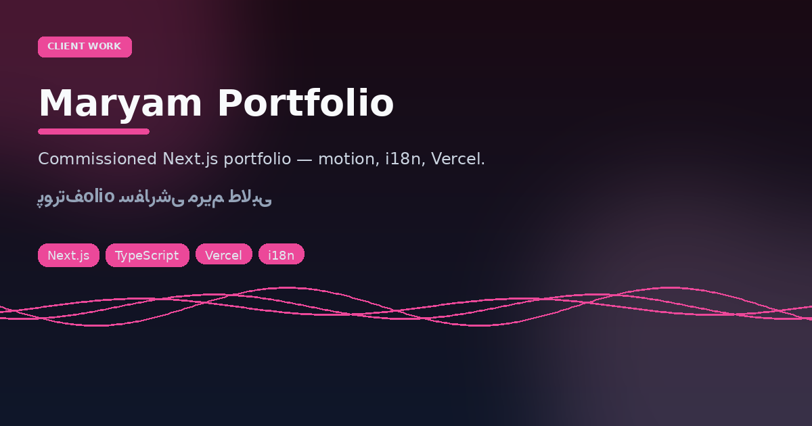
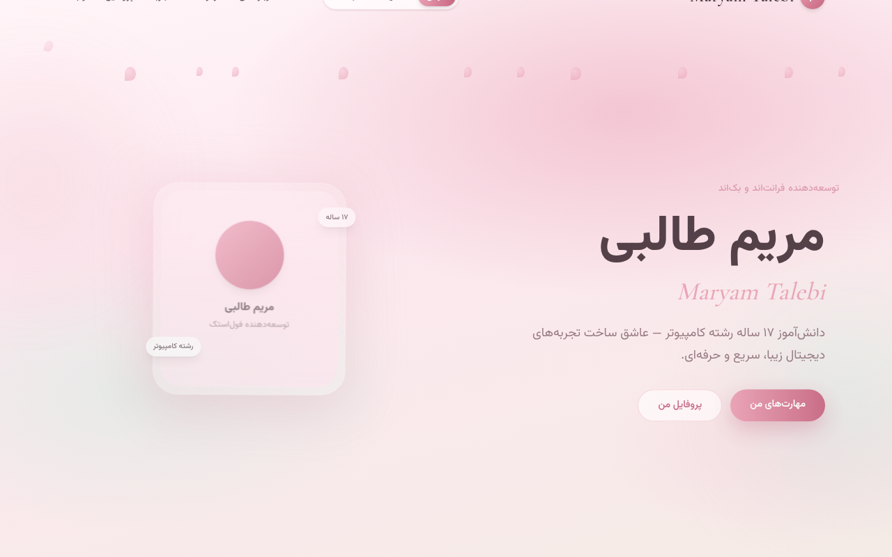

# Pertofilo Maryam
### Client portfolio commission — motion, bilingual UI, Vercel

<p align="center"></p>
<p align="center"></p>

<p align="center">


</p>

**Live:** [pertofilo-maryam.vercel.app](https://pertofilo-maryam.vercel.app)

Delivered as a polished personal site for **Maryam Talebi**: animated sections, i18n hooks, Tailwind 4, Next 16. This README is written from the integrator/creator angle — ship quality for a named client, not a generic template dump.

```bash
npm i && npm run dev
npm run build
```

---

## فارسی — پورتفolio مریم طالبی

پروژهٔ **سفارشی** پورتفolio با Next.js، انیمیشن Framer Motion، پشتیبانی چندزبانه و دیپلوی Vercel.

### اجرا

```bash
npm i && npm run dev
```

### تحویل

| مورد | وضعیت |
|------|--------|
| دامنهٔ دمو | Vercel لینک بالا |
| استایل | مدرن، متحرک، موبایل‌فرست |
| مالکیت محتوا | متعلق به صاحب‌پورتفolio |

اگر فورک می‌کنید، نام و کپی را عوض کنید — این یک قالب عمومی خام نیست، یک تحویل مشتری است.
