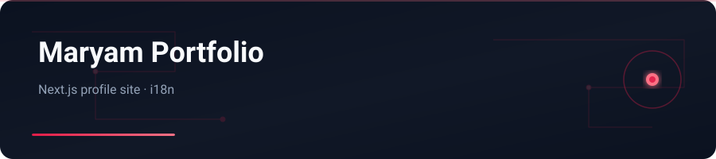

<div align="center">



</div>

# Pertofilo Maryam

Personal profile / portfolio site built with Next.js — animated sections, bilingual UI, deployed on Vercel.

---

## English


### Features

- Hero, about, skills, experience, contact sections
- Locale provider with translations
- Animated background and profile image handling
- Next.js App Router + TypeScript

### Stack

Next.js · TypeScript · React

### Getting started

```bash
git clone https://github.com/yasinfallahati/pertofilo-maryam.git
cd pertofilo-maryam
npm install
npm run dev
```
Live: https://pertofilo-maryam.vercel.app

---

## فارسی

### پورتفolio مریم

سایت پروفایل/پورتفolio با Next.js — بخش‌های انیمیشنی، رابط دوزبانه، دیپلوی روی Vercel.


### امکانات

- بخش‌های هیرو، درباره، مهارت، تجربه، تماس
- Locale provider با ترجمه‌ها
- پس‌زمینه انیمیشنی و مدیریت تصویر پروفایل
- Next.js App Router + TypeScript

### تکنولوژی‌ها

Next.js · TypeScript · React

### شروع کار

```bash
git clone https://github.com/yasinfallahati/pertofilo-maryam.git
cd pertofilo-maryam
npm install
npm run dev
```
لایو: https://pertofilo-maryam.vercel.app

---

`#nextjs` `#typescript` `#portfolio` `#vercel` `#i18n`
